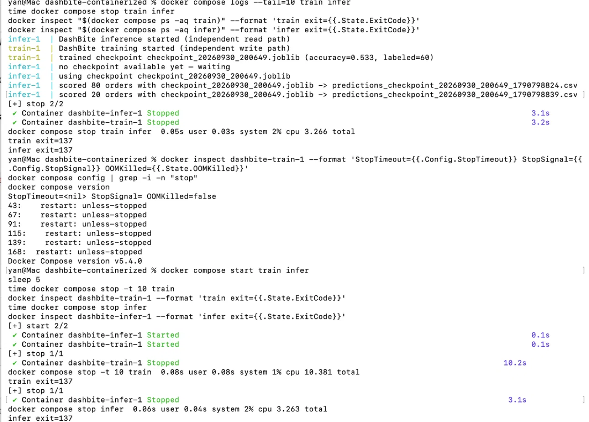
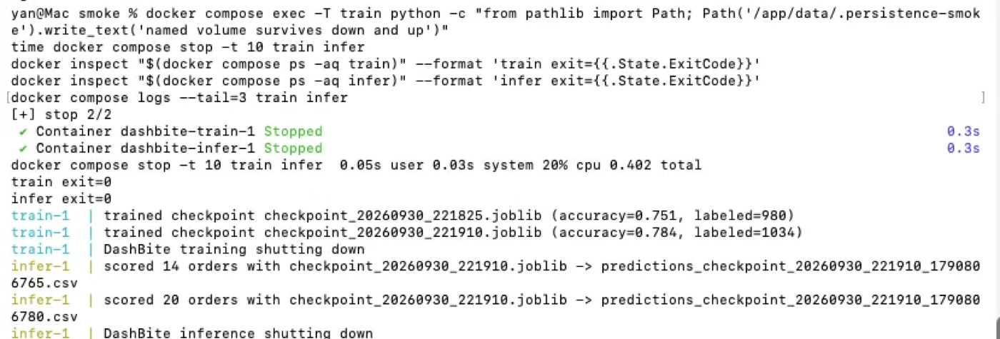
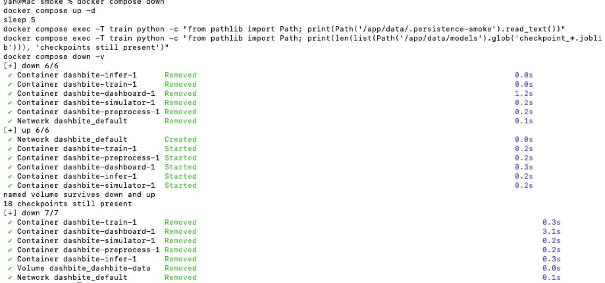
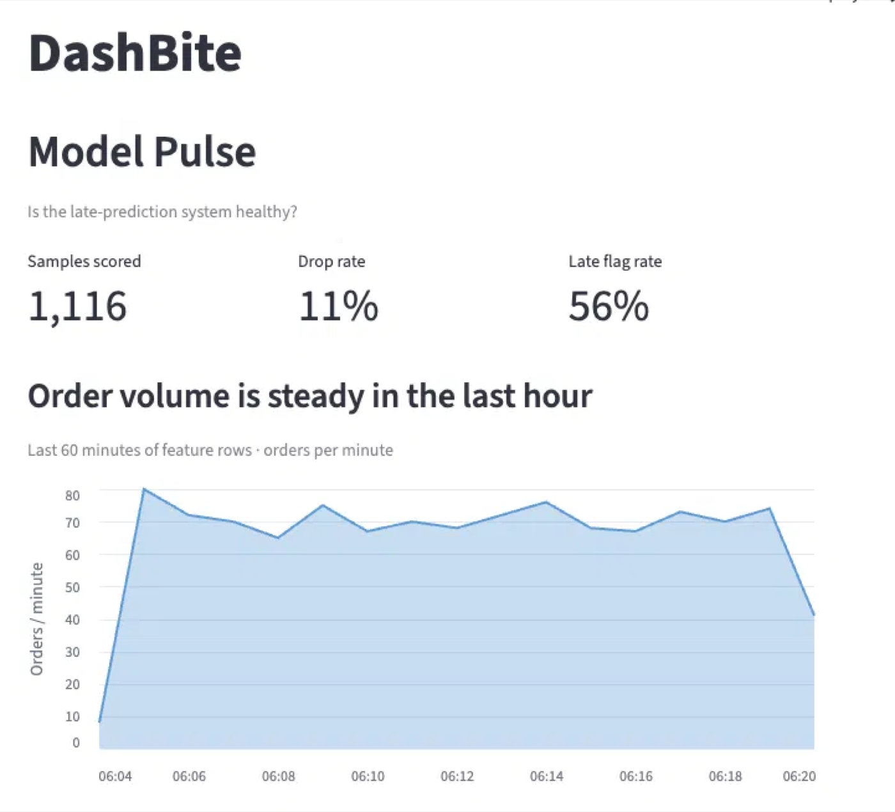
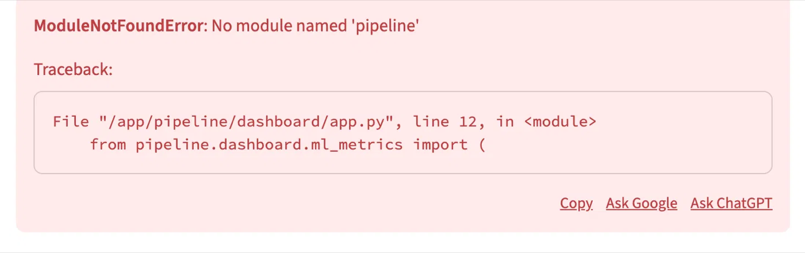
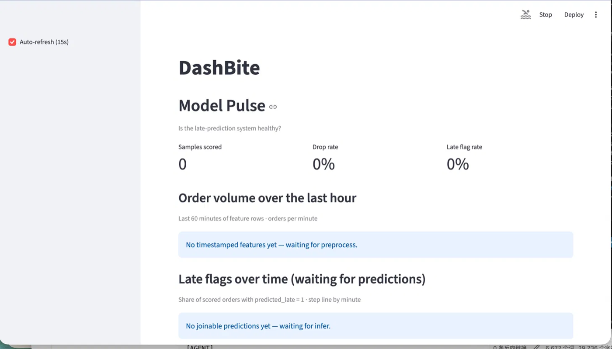

# DashBite — Simple Stage-by-Stage ML Pipeline

Teaching demo of a modular data + ML application. **DashBite** predicts whether a food-delivery order will be **late**.

Stages are separate Python modules that share folders under `data/`. Run them locally with the Makefile or together as a Docker Compose stack. Training and inference are **independent processes** coupled only by timestamped checkpoints in `data/models/`. Inference always uses the **newest** checkpoint.

## Stages

| Stage | Module | What it does |
|-------|--------|----------------|
| 0 | `pipeline.config`, `pipeline.paths` | Shared config + data folders |
| 1 | `pipeline.simulator` | Writes timed CSV batches to `data/raw/` (“new orders arrived”) |
| 2 | `pipeline.preprocess` | Drops bad rows, adds `hour` / `is_peak` → `data/features/` |
| 3 | `pipeline.train` | Retrains when ≥ `TRAIN_EVERY_N_EVENTS` new labeled rows; writes checkpoints |
| 4 | `pipeline.infer` | Scores unscored rows with newest checkpoint → `data/predictions/` |
| 5 | `pipeline.dashboard` | Streamlit: **Model Pulse** |

## Setup

```bash
make install
```

Or manually:

```bash
python3 -m venv .venv
source .venv/bin/activate
pip install -r requirements.txt
```

## Makefile shortcuts

```bash
make help          # list targets
make test          # full pytest gate
make run           # start all stages in background + dashboard
make stop          # stop background pipeline
make clean-data    # wipe runtime CSVs/checkpoints under data/
```

Foreground single stages: `make simulator`, `make preprocess`, `make train`, `make infer`, `make dashboard`.

Agent demo prompts (independent Architect / Implementer / Reviewer chats): `make prompts` → http://localhost:8502

GitHub Pages (static copy of the board): https://kedar-v.github.io/TestingAndContainerisationDemo/  
Rebuild after editing prompts: `make prompts-static`

## Testing gate (required after every stage)

After each stage you implement or change, run the **full** suite:

```bash
pytest
```

That runs **unit**, **regression**, and **integration** tests together so new work cannot break older stages.

```bash
pytest -m unit
pytest -m regression
pytest -m integration
```

Layout:

```
tests/
  unit/
  regression/
  integration/
  fixtures/
```

## Run the pipeline (background stack)

Classroom default — durable background jobs:

```bash
make run                 # simulator + preprocess + train + infer + Model Pulse
make status              # confirm each stage is UP
open http://localhost:8501
make stop
```

Logs: `.logs/*.log` · PIDs: `.logs/pids/` · Poll default: `POLL_INTERVAL_SECONDS=15`

Foreground single stages (one terminal each): `make simulator`, `make preprocess`, `make train`, `make infer`, `make dashboard`.

## Docker Compose

Start the single-replica pipeline and Model Pulse dashboard:

```bash
docker compose up --build -d
docker compose ps
docker compose logs -f simulator preprocess train infer dashboard
```

Open http://localhost:8501 for Model Pulse. The services share a named volume mounted at `/app/data`; its files survive `docker compose down`. Remove the volume explicitly with `docker compose down -v`.

Run the complete suite in the shared image with the opt-in test profile:

```bash
docker compose --profile test run --rm tests
```

`DATA_ROOT` identifies the data directory itself. Compose sets it to `/app/data`; local runs default to the repository's `data/` directory. An explicit `base` argument to the Python path helpers retains its project-directory meaning and takes precedence over `DATA_ROOT`.

Whole-file outputs are written to a same-directory `.tmp` file and published with `os.replace`. If a worker is SIGKILLed mid-write, a `<name>.tmp` file may remain; consumers do not glob these files, and a later write to the same destination overwrites it. The append-only `data/quality/batch_quality.csv` log is deliberately unchanged; appending to it is not atomic.

## Manual Smoke Test

Run by me on 2026-09-30 from a fresh clone (`/tmp/smoke`), Docker Compose v5.4.0, macOS.

| Check | Result |
|---|---|
| Fresh clone → `pip install -r requirements.txt` → `pytest` | ✅ 47 passed |
| `docker compose up --build -d` | ✅ 5 services up, dashboard healthy |
| Files flow through the shared volume | ✅ raw → features → models → predictions + quality log |
| No leftover atomic-write temp files after 13 min | ✅ no `.tmp` anywhere under `/app/data` |
| Dashboard in browser | ✅ Model Pulse renders with live data (1,116 samples scored) |
| Stop behavior (see below) | ✅ fixed |
| Data persists across `down` / `up` (no `-v`) | ✅ marker file and 18 checkpoints survived |

**Before vs after graceful shutdown** (`time docker compose stop -t 10 train infer`):

| | Stage 6 (before) | Stage 7 (after) |
|---|---|---|
| Time | 10.2 s | 0.4 s |
| Exit codes | 137 / 137 (SIGKILL) | 0 / 0 |
| Log | none | `... shutting down` |

Note: with Compose's default timeout my environment killed the workers after ~3 s, not the 10 s I had assumed, so I used an explicit `-t 10` for a fair before/after comparison.









**Problem found during testing: dashboard import error**

The dashboard container reported *healthy*, but opening the page failed with `ModuleNotFoundError: No module named 'pipeline'`. Streamlit's health endpoint only proves the server is up; the app script runs when a browser session connects, so the healthcheck could not catch it. Fixed by setting `PYTHONPATH=/app` in the Dockerfile, then verified in the browser.





## Containerization Sources

**From the course guide** (`docs/docker-k8s-guide.md`): one shared image with a different command per service, one Compose service per stage, a shared named volume, the `DATA_ROOT` concept, explicit demo environment values, and keeping the workers single-replica.

**My additions and corrections:**
- A Compose `build:` context — the guide's Compose file referenced an image it never built.
- `restart: unless-stopped` on every long-running service (the guide had it only on the simulator).
- `PYTHONUNBUFFERED=1`, so `print()` logs appear live in `docker compose logs`.
- `PYTHONPATH=/app` — without it the dashboard crashed with `ModuleNotFoundError` in the browser while still reporting *healthy*.
- A non-root user that owns `/app/data`, so a fresh named volume is writable.
- A Python-stdlib healthcheck for the dashboard (no `curl` in the slim image), documented as checking server availability only.
- An opt-in Compose `test` profile that runs the full suite in the image.
- `DATA_ROOT` actually implemented (the guide described it, but the code ignored it), with precedence: explicit `base` > `DATA_ROOT` > `PROJECT_ROOT/data`.
- Atomic `.tmp` + `os.replace` publication for whole-file outputs; the append-only quality log stays a documented limitation.
- Event-based SIGTERM/SIGINT shutdown for the four workers (exit 137 → 0).

Out of scope by my decision: Kubernetes, the Prompt Board, and `--scale infer=2` (multiple infer replicas would double-score orders without a claim mechanism).

## Config (environment)

| Variable | Default | Meaning |
|----------|---------|---------|
| `TRAIN_EVERY_N_EVENTS` | `2000` | Retrain after this many **new** labeled rows |
| `BATCH_SIZE` | `50` | Orders per simulator tick |
| `POLL_INTERVAL_SECONDS` | `15.0` | Sleep between polls/ticks |
| `RANDOM_SEED` | `42` | Training seed |
| `CORRUPT_BATCH_RATE` | `0.25` | Fraction of batches that include NaNs / bad types |

Preprocess logs per-batch **throughput** and **field-level failures** to `data/quality/batch_quality.csv`. Model Pulse shows these live.

## Design notes for class

- Intake uses **batch CSV files** under the hood; logs say “new orders arrived”.
- Train **only writes** `data/models/checkpoint_*.joblib`.
- Infer **only reads** that folder and never imports train.
- Dashboards read `data/features/` and `data/predictions/` — test the metric helpers with `pytest`, not the browser UI.
